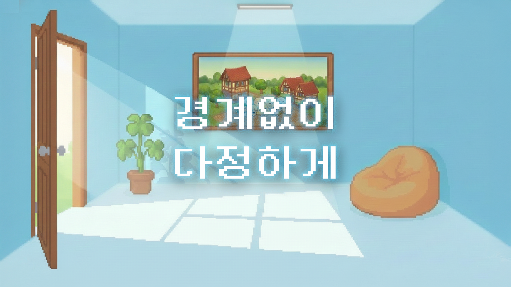
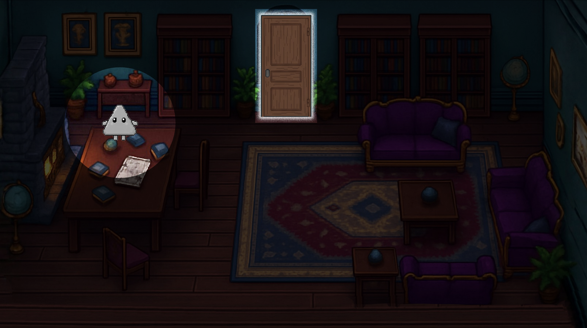
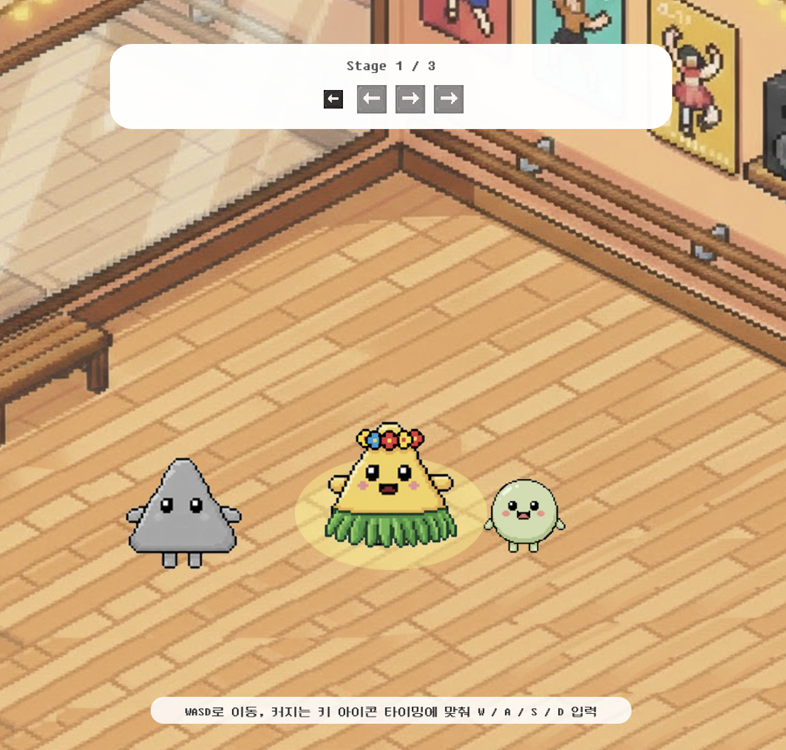
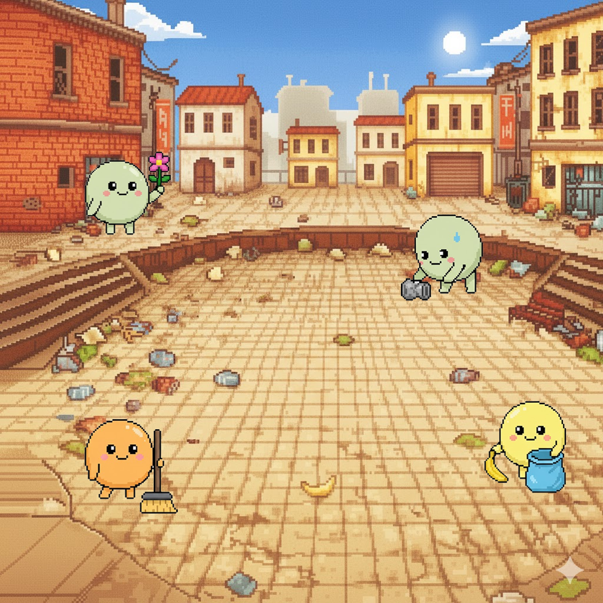
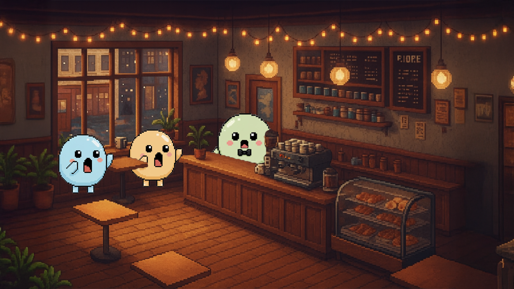

# 경계없이, 다정하게 🌈 (Without Borders, With Kindness)
> 본 프로젝트는 2025-2 카카오임팩트 × 테크포임팩트 캠퍼스 프로그램의 지원으로, 발달장애청년허브 사부작과 함께 발달장애청년의 사회적 고립 문제를 마을 관점에서 다루는 체험형 인터랙티브 웹게임을 개발하였습니다.
<p align="center">
  
</p>


## 프로젝트 개요

### 🎯 문제 상황
- 성인 전환기 이후 발달장애청년이 평일 낮 시간 대부분을 집에서 보내며, 지역사회 안에서 머물 **일상적인 공간과 관계망**이 부족한 상황
- **보호자의 단독 돌봄 부담**이 크고, 발달장애청년의 일상과 경험이 사회 전반에 충분히 공유되지 못하는 현실

### 💡 해결 아이디어
- 발달장애청년허브 **사부작**의 실제 활동과 서사를 바탕으로,  
  발달장애청년의 하루를 당사자 시점에서 플레이해보는 **웹 기반 인터랙티브 게임 〈경계없이, 다정하게〉**
- 플레이 구조:
  - 집 안 프롤로그에서 **고립과 돌봄 공백** 인식
  - 훌라·공공시민노동 미니게임을 통해 **관계와 역할** 체험
  - 옹호가게에서 **함께 사는 마을의 방식** 이해
  - 엔딩에서 **후원·방문 등 현실 참여 경로** 연결

### ✨ 핵심 가치
- **인식 전환**  
  성인 발달장애청년의 고립을 **내가 사는 동네에서도 경험할 수 있는 일**로 받아들이게 하는 관점 전환.

- **체험 기반 학습**  
  강의·영상 중심 교육을 보완하는 **짧은 몰입형 플레이 경험** 제공

- **현실 참여 연결**  
  게임 엔딩을 통해 사부작 활동, 옹호가게, 후원·공유 등으로 이어지는 **구체적인 참여 경로** 제시


## 주요 기능

### 🏠 집 안 프롤로그 – 고립과 돌봄 공백 인식
<p align="center">
  
</p>

- 어두운 집 안을 돌아다니며 **육아수첩, 일기장, 편지** 등 오브젝트를 클릭해 내용을 읽는 탐색형 구성
- 사부작에서 실제로 나온 **보호자·청년의 문장**을 재구성하여 배치
- 당사자와 보호자가 겪는 정서와 상황을 간접적으로 체험할 수 있도록 설계
- 졸업 이후의 공백, 보호자의 부담, 집에 머무를 수밖에 없는 현실 등을 통해 **성인 발달장애청년의 고립 문제**를 인식하게 됨

### 🌳 마을광장 & 미니게임 – 관계와 역할 체험
<p align="center">
  
  
</p>

- **훌라 미니게임**  
  - 사부작 훌라 동아리 **선샤인아놀드훌라**를 모티브로 한 구성
  - 언어 중심 소통이 아닌, **함께 춤추는 경험**을 통해 발달장애청년의 **자기표현과 관계 형성 방식**을 보여주는 장면

- **마을 공공시민노동 미니게임**  
  - 종이팩을 모아 교환하는 실제 **공공시민노동 활동**을 모티브로 한 구성  
  - 쓰레기를 줍고, 분리배출을 돕고, 동네를 청소하는 과정을 통해  
    발달장애청년을 **일방적인 도움이 필요한 존재가 아닌 마을에 기여하는 주체**임을 나타냄 

### 🏪 옹호가게 & 엔딩 – 함께 사는 방식과 참여 경로
<p align="center">
  
</p>

- 실제 옹호가게 사례를 각색한 스토리를 기반으로, 가게 주인이 주인공을 **동네 사람 중 한 명**으로 자연스럽게 맞이하는 모습
- 옹호가게를 발달장애청년이 **자주 오고 가는 일상 공간**으로 보여줌으로써, **함께 사는 마을의 구체적인 모습**을 제시
- 엔딩 화면에서 **사부작 SNS**, **카카오같이가치 후원 페이지** 로 이어지는 링크 제공
- 플레이 이후 **관심 → 후원·공유·방문 등 행동으로 이어지는 참여 경로**를 제안하는 마무리 구조


## 데모 및 문서 링크
- **서비스 링크(배포 URL)**: http://127.0.0.1:5500/index.html
- **컨셉 영상**: https://drive.google.com/file/d/1Sdgp4fqK4S1jLtLq_S9-20WRMAZ4lAPA/view?usp=sharing
- **발표 자료(PDF)**: https://drive.google.com/file/d/14D0nh53PvGxZqztDfCXcbU63KR8gGvnR/view?usp=sharing


## 기술 스택

| 분야        | 사용 기술                                       |
|-------------|-------------------------------------------------|
| Frontend    | HTML, CSS, JavaScript, p5.js                    |
| AI/Model    | Gemini, Midjourney, Runway (이미지·영상 생성)   |
| Infra/DevOps| Replit (개발 및 배포 환경), Git, GitHub         |


## 설치 및 실행 방법
1. 깃허브에서 전체 파일 다운로드
2. visual studio code 다운로드 후 Live Server, p5.vs code 확장프로그램 다운로드
3. index.html 우클릭 후 openinliveserver에서 열기 및 실행

## 팀 소개
**팀명: 우리들의 사부작 드라마**

| 이름   | 역할                    | 담당 업무                                             | 소속           |
|--------|-------------------------|-------------------------------------------------------|----------------|
| 이은비 | PM / 기획 총괄          | 프로젝트 매니징, 전체 콘셉트·서비스 기획, 회의 진행  | 자유전공학부   |
| 고은설 | 시나리오·영상 기획      | 게임 전체 시나리오 구성, 대사·장면 기획, 영상 기획·제작 | 미학과         |
| 김경민 | 디자인·그래픽           | 게임 내 그래픽·UI 디자인, 컨셉 영상 제작             | 사회학과       |
| 홍정우 | 개발                    | 웹게임 개발, 인터랙션 및 씬 전환 구조 설계          | 고고미술사학과 |


## 협력 기관 및 멘토
### 협력 기관
- **발달장애청년허브 사부작**
  - 실제 프로그램(훌라 동아리, 마을 공공시민노동, 옹호가게 등)에 대한 자료·사례 제공
  - 게임 내 에피소드 및 세계관 설계 과정에서 내용 검토 및 피드백 제공
- **카카오임팩트 × 테크포임팩트 캠퍼스 (2025-2)**  
  - 프로젝트 전반에 대한 장학·운영 지원
  - 최종 결과물 발표 및 소셜 임팩트 관점 피드백

### 멘토
- **김채현 멘토 (카카오 비즈니스 백엔드 개발 담당)**  
- **장원진 멘토 (카카오페이 프론트엔드 개발 담당)**  
  - 서비스 개발에 대한 기술 자문  
  - 웹 배포 방식 및 안정성 관련 피드백

## 프로젝트 성과 및 향후 계획
### ✅ 현재까지의 성과
- **웹게임 완성**
  - 약 10~15분 분량의 웹 기반 인터랙티브 스토리 게임 구현  
  - 프롤로그(집 안) → 마을광장·미니게임 → 옹호가게 → 엔딩까지 하나의 흐름으로 플레이 가능

- **내부·소규모 유저 테스트 및 개선**
  - 팀 내부 플레이와 사부작 펠로우에게 게임을 시연하고 표현·구성에 대한 피드백 수렴  
  - 피드백을 바탕으로  
    - 프롤로그 텍스트를 간소화하고 **핵심 서사** 중심으로 재구성  
    - 미니게임 난이도·조작법 안내를 조정해 진입장벽 완화  

- **스토리·표현 원칙 정립**
  - 고립·돌봄·노동·마을 관계 등 **구조적 문제**에 초점을 둔 스토리라인 정립 
  - 게임 구조가 실제 사부작 프로그램과 **1:1로 대응**되도록 설계


### 🚀 배포 및 확산 계획
- **플레이 인증 이벤트 운영**
  - 게임을 플레이한 뒤 **엔딩 화면 캡처 + 짧은 소감 제출**시 참여 완료  
  - 온라인 커뮤니티, 학과·동아리 네트워크를 통해 **링크·QR을 배포**하여 자발적 참여 유도

- **전시 및 체험 공간 연계**
  - 정보문화학 과제전 등 전시 현장에서 QR과 안내물을 비치해 관람자가 직접 플레이해 볼 수 있도록 구성

- **교육 현장 파일럿**
  - 1차 대상: **발달장애청년허브 사부작, 성미산학교 등 인접 교육 현장**  
  - 형식: 인권·장애인식 교육 시간에 **“10~15분 플레이 + 짧은 토론”** 방식으로 도입
  - 교사·학생 피드백을 바탕으로 **게임 내용·교안 개선**  
  - 이후 **서울시 교육청, 인권·상담센터 등**으로 파일럿 범위를 단계적으로 넓혀 갈 계획

    
### 🔭 기능 및 콘텐츠 고도화 계획
- **플레이 데이터 기반 개선**
  - 플레이 수, 평균 플레이 시간, 이탈 구간 등을 분석해 난이도·텍스트·선택지 조정  
  - 엔딩 완주율을 높이기 위한 UX·스토리 보완

- **추가 에피소드 및 세계관 확장**
  - 길동무 동아리·문화 활동 등 사부작 프로그램 기반 에피소드 추가 검토 
  - 보호자·이웃 등 **다양한 관점의 서사**을 담는 스토리 확장

- **다른 마을 모델로의 확장**
  - 추후 다른 지역 커뮤니티와 협업해 각 마을 맥락을 반영한 버전으로 확장하는 방안 검토  
  - “1동 1사부작” 목표에 맞춰 지역별 커스터마이징 가능한 형태로 발전시키는 것을 장기 목표로 설정


## 프로젝트 구조

```text
main/
├─ index.html            # 메인 HTML, p5 스케치 및 스크립트 로드
├─ style.css             # 전체 공통 스타일
├─ main.js               # 게임 전반의 흐름 제어, 씬 전환 로직
├─ start.js              # 타이틀 / 시작 화면
├─ intro.js              # 프롤로그(집 안 탐색) 씬
├─ sketch_map.js         # 마을 지도·광장 씬
├─ sketch_hula.js        # 훌라 미니게임 스케치
├─ minigameB.js          # 공공시민노동(종이팩 교환) 미니게임
├─ dialogue_minigame.js  # NPC 대사 및 미니게임 관련 대화 로직
├─ ongho.js              # 옹호가게 씬
├─ ending.js             # 엔딩 씬
├─ ending_return.js      # 엔딩 이후 귀가/마무리 흐름 관련 스크립트
├─ tutorial.js           # 조작법 안내 등 튜토리얼 스크립트
├─ assets/               # 이미지·오디오 등 게임 리소스
│  └─ ...                
└─ libraries/            # 외부 라이브러리
   ├─ p5.min.js          # p5.js 메인 라이브러리
   └─ p5.sound.min.js    # p5.js 사운드 확장
```

## 저작권 및 라이선스
- **코드 및 기획**
  - 본 저장소 내 소스코드와 기획 문서는 팀 “우리들의 사부작 드라마”가 작성한 것으로, 별도의 라이선스가 명시되지 않는 한 해당 저장소에서만 활용되는 것을 기본으로 합니다.

- **서사 및 설정**
  - 게임에 등장하는 사부작·성미산 마을 관련 서사와 설정은 발달장애청년허브 사부작과의 협의를 거쳐 활용했습니다.
  - 사부작 고유의 이야기와 프로그램 내용은 무단 복제·전재를 금합니다.

- **이미지 / 아이콘 / 영상**
  - 게임 및 발표 자료에 사용된 일부 이미지·일러스트는 Gemini, Midjourney, Runway 등 생성형 AI 도구를 활용해 제작하였으며,  
    후처리는 Adobe Premiere Pro 및 VLLO로 편집했습니다.
  - 발표 자료에 사용된 아이콘은 Flaticon 에서 제공하는 리소스를 사용했으며, Flaticon 라이선스 정책을 준수하는 범위 내에서 활용했습니다.

- **폰트**
  - 본 프로젝트에는 길형진(orioncactus) 님이 제작한 둥근모꼴(DungGeunMo) 픽셀 폰트를 사용했습니다.
  - 제작자 안내에 따라, 원본과 동일한 퍼블릭 도메인 형태로 재배포·수정·영리 목적 사용이 허용되는 폰트입니다.

- **기타**
  - 그 외 서드파티 라이브러리(p5.js 등)는 각 프로젝트의 라이선스를 따릅니다.
